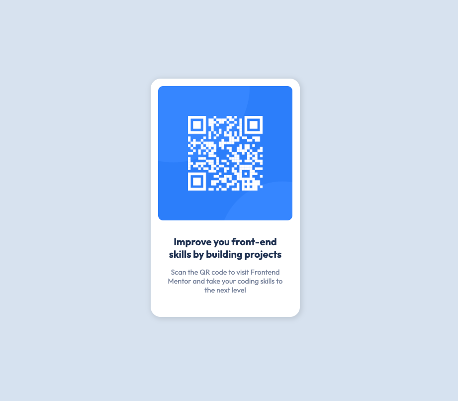

# Frontend Mentor - QR code component solution

This is a solution to the [QR code component challenge on Frontend Mentor](https://www.frontendmentor.io/challenges/qr-code-component-iux_sIO_H). Frontend Mentor challenges help you improve your coding skills by building realistic projects. 

## Table of contents

- [Overview](#overview)
  - [Screenshot](#screenshot)
  - [Links](#links)
- [My process](#my-process)
  - [Built with](#built-with)
  - [What I learned](#what-i-learned)
  - [Continued development](#continued-development)
  - [Useful resources](#useful-resources)
- [Author](#author)
- [Acknowledgments](#acknowledgments)


## Overview

### Screenshot




### Links

- Live Site URL: [Live Site](https://praveenkum11.github.io/qr-code-component-frontendmentor/)

## My Process

### Built with

- Semantic HTML5 markup
- CSS custom properties
- Flexbox
- CSS Grid
- Mobile-first workflow


### What I learned

Great to add sane variables to use later
```css
:root {
    --clr-white: hsl(0, 0%, 100%);
    --clr-light-gray: hsl(212, 45%, 89%);
    --clr-grayish-blue: hsl(220, 15%, 55%);
    --clr-dark-blue: hsl(218, 44%, 22%);

    --font-family-default: 'Outfit', sans-serif;

    --fw-regular: 400;
    --fw-bold: 700;

    --fs-400: 1.125rem;
    --fs-500: 1.25rem;
    --fs-600: 1.5rem;
    --fs-700: 2rem;
}
```

Use of locally scoped properties to use in children component
```css
.qr-code-container {
    --border-radius: 20px;
    border-radius: var(--border-radius);
}

.qr-code-container > img {
    border-radius: calc(var(--border-radius) - 10px);
}
```

Default responsive images and svg - using css reset
```css
img,
svg {
    display: block;
    max-width: 100%;
}
```

Center items horizontally and vertically using just two lines
```css
body {
  display: grid;
  place-content: center;
}
```

### Continued development

Learn more about flex box and grids.

### Useful resources

- [From Design to Code // HTML & CSS from scratch // Frontend Mentor](https://www.youtube.com/watch?v=KqFAs5d3Yl8&t=1s) - Great video that covers the thought process to convert a design to code and use of semantic html also some neat css techniques.

## Author

- Website - [Praveen Kumar](https://praveenkum11.github.io/portfolio/)
- Frontend Mentor - [@PraveenKum11](https://www.frontendmentor.io/profile/PraveenKum11)


## Acknowledgments

https://www.youtube.com/@KevinPowell